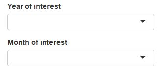
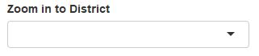
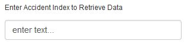
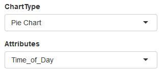
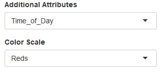

README
================

### About

Welcome! Here on this page, you can find the details about the bit and pieces that were used to create this app. We will also provide a brief guidelines on the features of this app. <br><br> This app was developed as a assignment for University of Malaya's Principles of Data Science (WQD7001) Master coursework. Our ultimate goal is however to provide a platform to easily visualize UK fatal road accidents data. We hope that this is beneficial to the users and can serve as an example for future work.

### Features on Map Visualization

Under Map Visualization tab, We can filter the data set to show only relevant years or months on the map. The visualization on the map are clustered. When not clustered, a single red circle marker represent a fatal accident. There is a popup information table when clicked on the red circle marker. <br> 

If we wish to zoom into the map based on district level, there is a separate select input to do so:<br> 

And if we wish to view specific details on a given Accident index, we can input the accident index ID on the given textbox. The result will be a zoomed in view to the accident location, and a table at the bottom of the map. <br> 

### Features on Chart Visualization

On the next tab is the tab for Chart Visualization. On this tab, we designed it in a way for users to select chart types according to their preference. Three Chart options namely: PieChart, Histogram and 2DHistogram are allowed. Users can select the Attributes desired to be plotted on the chart. <br> 

For 2D Histogram that needs a second attribute, an additional attribute selection is triggered when user select 2D Histogram as the desired Chart Type. A Color Scale option is also available for user to select the desired color on the 2DHistogram.<br> 

### Datasets

-   UK 2005-2015 road accidents datasets datasets <https://www.kaggle.com/silicon99/dft-accident-data><br> &lt;Accidents0515.csv&gt;,&lt;Vehicles0515.csv&gt;,&lt;Casualties0515.csv&gt;

-   Road-Accident-Safety-Data-Guide <http://data.dft.gov.uk/road-accidents-safety-data/Road-Accident-Safety-Data-Guide.xls><br> &lt;Road-Accident-Safety-Data-Guide.xls&gt;

-   UK Map Polygons geojson file <https://blog.exploratory.io/making-maps-for-uk-countries-and-local-authorities-areas-in-r-b7d222939597><br> &lt;uk\_la.geojson&gt;

### Datasets Cleaning And Processing

A simple EDA was done in the beginning using

``` r
head(), summary(), str(), boxplot()
```

After identifying NA and missing variables, we remove rows with all NA cells, and imputed individual NAs in attribute columns as 'Data Missing'

``` r
#Rows with All NAs have less than 8 characters in Accident_Index 
myAccidents=myAccidents[!(nchar(as.character(myAccidents$Accident_Index))<8),]
myVehicles=myVehicles[!(nchar(as.character(myVehicles$Accident_Index))<8),]
myAccidents=myAccidents[!(nchar(as.character(myVehicles$Accident_Index))<8),]

myAccidents[is.na(myAccidents)]= -1 
myVehicles[is.na(myVehicles)]= -1
myVehicles[is.na(myAccidents)]= -1
```

Since we are only interested with accidents that have fatalities, we filter the data based on Accident Severity

``` r
myAccidents = myAccidents%>%filter(myAccidents$AccidentSeverity ==1)
myVehicles = myVehicles%>%%>%filter(myAccidents$AccidentSeverity ==1)
myCasualties = myVehicles%>%%>%filter(myAccidents$AccidentSeverity ==1)
```

Next we join both datasets on Vehicles rows according to accident index

``` r
cleanDataset = left_join(myVehicles,myAccidents)
cleanDataset = left_join(myVehicles,myCasualties)
```

We dropped attributes that we think were irrelevant to visualization, and plug that into the shiny app. The shiny source code can be found on github.<br> <https://github.com/EnJunChoong/RoadToZeroFatality>

### R packages used

-   Shiny <https://github.com/rstudio/shiny>
-   Leaflet <https://github.com/rstudio/leaflet>
-   tidyverse <https://github.com/tidyverse/tidyverse>
-   shinythemes <https://github.com/rstudio/shinythemes>
-   kableExtra <https://github.com/haozhu233/kableExtra>
-   plotly <https://github.com/ropensci/plotly>
-   ggthemes <https://github.com/jrnold/ggthemes>
